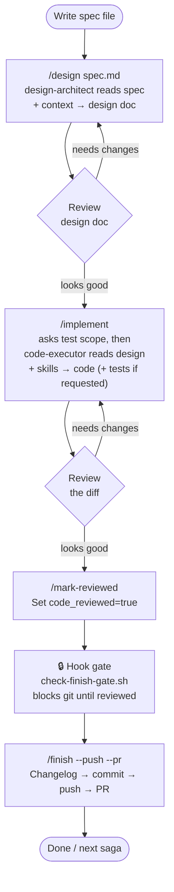

# saga

A Claude Code plugin implementing a gated development workflow — from first rune to finished saga:
codebase context bootstrapping → AI design (human review, not enforced) → AI implementation
→ code review (human-gated) → changelog/commit/PR.

Built for a Java / Spring Boot / PostgreSQL / jOOQ stack, but the workflow
skeleton (commands, agents, hooks) is stack-agnostic — only the four skills
under `skills/` are stack-specific.

## Install

**Try it without installing anywhere permanent:**

```bash
claude --plugin-dir /path/to/saga
```

**Local plugin, no marketplace:** copy this directory into your project's
`.claude/plugins/` (or a personal plugins directory — check `claude plugin
--help` on your installed version for the exact discovery path, this has
moved around across recent releases). Then in a session:

```
/plugin validate ./saga    # sanity-check the manifest/frontmatter first
```

**Sharing with the team (optional, opt-in):** publish this directory as an
entry in a `marketplace.json` (personal GitHub repo is enough) and let people
`/plugin marketplace add <your-repo>` + `/plugin install saga`
if they want it. Nobody is forced into it by cloning the main project repo.

## Usage

```
/init-context                      # once per project: generates .claude/context/*, CLAUDE.md, workflow state, offers a scoped Read/Edit/Write + build-command allowlist
/design specs/PROJ-123.md          # phase 1: produces docs/design/proj-123-design.md (incl. Given-When-Then test scenarios + a recommended model), stops for review
# ... you read the design doc — no enforced gate, but read it before continuing ...
/implement                         # phase 2: confirms the recommended model (if not sonnet) and asks test scope (none/unit/unit+integration), then implements
# ... you review the diff ...
/mark-reviewed                     # phase 3 gate
/finish --push --pr                # phase 4: changelog, commit, push, open PR
```

Each phase writes `.claude/workflow/state.json` in the *project*, not the
plugin — that's how the finish hook knows whether code review happened. If
you ever need to unstick a bad state, it's a plain JSON file; edit it
directly.

## Workflow

> **Pre-requisite:** run `/init-context` once per project to bootstrap `.claude/context/` docs,
> customise the stack skills to your codebase, and initialise the workflow state file.
> It is not part of the repeating development loop below.




## Why hooks instead of just telling Claude the order

Skills, commands, and CLAUDE.md instructions are all probabilistic — Claude
uses judgment about whether to follow them. The one hard-to-reverse action in
this workflow is committing/pushing code, so that's the one gate enforced by
`hooks/hooks.json` + `hooks/scripts/check-finish-gate.sh`, which blocks via
exit code 2 regardless of what the model decides. The design step (`/design`
→ `/implement`) is intentionally *not* gated this way — implementation writes
are reversible and reviewable in the diff, so it's left to the model prompt
and the user's own judgment rather than a hard block. `/finish` also checks
state explicitly before delegating, so you get a clean message instead of a
raw hook block where possible.

## Things to verify before you trust this in anger

I built this against the current Claude Code plugin/skill/hook docs, but a
few specifics are worth double-checking on your installed version before
relying on it for real work, since this surface has been moving fast:

- **Hook stdin/JSON shape** — the scripts assume `tool_input.file_path` for
  Write/Edit and `tool_input.command` for Bash. Run `claude --debug` once and
  trigger each hook manually to confirm the payload shape matches; adjust the
  `python3 -c` parsing in `hooks/scripts/*.sh` if it doesn't.
- **`agent:` cross-referencing between plugin components** — `design.md` and
  `implement.md` currently tell Claude in plain language to delegate to the
  `design-architect` / `code-executor` subagents by name rather than relying
  on a `context: fork` + `agent:` frontmatter combo, since I wasn't certain
  that combo resolves custom plugin-provided agent names reliably. If your
  version supports it cleanly, wiring it in directly would be tighter than
  prose delegation.
- **Per-call model overrides on prose-delegated subagents** — `implement.md`
  asks whether to switch to the design doc's recommended model (`agents/design-architect.md`
  rule 8) and, if you say yes, *attempts* to pass that as an override when
  delegating to `code-executor`. Same root uncertainty as the bullet above:
  `code-executor.md`'s `model: sonnet` frontmatter is the one thing guaranteed
  to take effect, and I haven't confirmed a per-invocation override reliably
  beats it on every Claude Code version. `/implement` is written to say so in
  its summary rather than assert the switch worked — but if you're relying on
  this for cost/capability control, verify once by checking which model
  actually ran before trusting it silently.
- **`python3` availability** — `check-finish-gate.sh` assumes it exists on
  the dev machine. Swap for `jq` or whatever's actually on your PATH if not.
- **`fewer-permission-prompts` availability** — `/init-context` and
  `/implement` both point you at this skill for backfilling the allowlist
  beyond what step 6 pre-approves (see "Reducing permission prompts" below).
  It's a Claude Code built-in, not something this plugin ships, so if your
  installed version doesn't have it the pointer is a harmless no-op —
  nothing else in the workflow depends on it existing.

## Reducing permission prompts

Two complementary layers, not one — the split exists because `/init-context` can pre-approve the *predictable* stuff (where source lives, which build commands are exact and safe) but can't know your actual Bash usage patterns ahead of time:

- **`/init-context` step 6** — a one-time, upfront allowlist written when you bootstrap the project, asked explicitly rather than assumed. It's not just `Read`: measured over 18 real sessions, `Edit`/`Write` prompts (~94 calls) badly outnumbered Bash prompts (mostly 1-2 occurrences each), so step 6 offers scoped `Edit`/`Write` allow entries under the directories saga actually touches (source, `docs/`, `.claude/`) plus a handful of *exact* build commands (e.g. `Bash(./gradlew test *)`, never a wildcard like `Bash(./gradlew *)` which is equivalent to arbitrary execution), alongside the `Read` allowlist with secrets explicitly denied.
- **The `fewer-permission-prompts` skill** — a Claude Code built-in (not shipped by this plugin), for the long tail step 6 doesn't try to predict. Run it after you've done a few `/design` → `/implement` cycles and it'll scan your actual session transcripts for repeated read-only Bash/MCP calls and backfill `permissions.allow` in `.claude/settings.json` with exactly what you've been getting prompted for. It only ever touches `permissions.allow`, never `deny`/`ask`, and refuses to allowlist anything that grants arbitrary code execution (interpreters, shells, unscoped task-runner wildcards). `/implement` will nudge you toward it if a run hit noticeable Bash prompts beyond what step 6 already covered.

Both write to the project's `.claude/settings.json` (shared, version-controlled) and never to `.claude/settings.local.json`, and both merge rather than overwrite. Run the skill again periodically as your build/test workflow evolves — it's additive and safe to re-run.

## Customizing for your actual codebase

The four skills in `skills/` are deliberately written as starting points with
placeholder conventions — run `/init-context` first, then go back and replace
the placeholders in `skills/*/SKILL.md` with what `.claude/context/PATTERNS.md`
actually says about your codebase, so the code-executor agent isn't working
from generic best practices when your team's real conventions differ.

## Roadmap notes

- `/design` reads a markdown file today. The command body is written to make
  swapping in a JIRA MCP connector (`--source=jira --ticket=<id>`) a change
  localized to that one command, not the rest of the pipeline.
